# 24bit7 User Manual

24bit7 builds playlists from your own JRiver library around whatever is playing. Press a button and Playing Now is rebuilt around the current track while the music keeps going, using recommendations from Last.fm, ListenBrainz, Deezer, YouTube Music and, if you want it, AI. Anything it recommends that you don't own is logged, so the misses become a shopping list.

This manual explains every part of the app. The [README](https://github.com/24bit7/24bit7#readme) on GitHub has the overview and what's new in each version.

## Contents

1. [Getting started](#getting-started)
2. [The Play tab](#the-play-tab)
3. [The Discover tab](#the-discover-tab)
4. [Settings](#settings)
5. [How playlists are built](#how-playlists-are-built)
6. [Voice Commands](#voice-commands)
7. [Setting up the Alexa skill](#setting-up-the-alexa-skill)
8. [When something goes wrong](#when-something-goes-wrong)
9. [Sources and your data](#sources-and-your-data)

---

## Getting started

### What you need

- A Windows PC.
- JRiver Media Center or Media Server, with Media Network switched on: in JRiver, Tools > Options > Media Network > **Use Media Network to share this library**. 24bit7 talks to JRiver on the same PC by default, on port 52199.
- Nothing else to begin with. Deezer and YouTube Music need no keys, so a fresh install builds playlists straight away.

You can try 24bit7 without JRiver at all: the Search tab with Output set to YouTube needs no library.

### Installing

1. Download the zip for the latest version from the [Releases](https://github.com/24bit7/24bit7/releases) page. It's under **Assets** at the bottom of the release, below the two "Source code" downloads, which are only the Python files.
2. Unzip it anywhere you like and run `24bit7.exe`.
3. Windows will probably show a blue **"Windows protected your PC"** box the first time, because the exe isn't code-signed. Click **More info**, then **Run anyway**. It only asks once.

To run from source instead, you need Python 3.10 or newer. Run `pip install -r requirements.txt`, then run `gui.pyw`.

### The first run

24bit7 opens on Settings and says hello once. Deezer and YouTube Music are already ticked as sources. For better playlists, add free keys for Last.fm and ListenBrainz under **Settings > Keys**, then tick them under **Settings > Sources**. Each key has a **?** button with the steps for getting it.

### Upgrading

Your settings and history live in two files next to the app: `.env` (settings and keys) and `24bit7.db` (cache and Discover history). Copy both into the new version's folder and everything carries over. Settings from older versions are converted automatically. When a release changes the Alexa skill, as 1.12.0 does, paste the new `alexa\interaction_model.json` and `alexa\lambda_function.py` into the Alexa developer console as in [Steps 4 and 5](#step-4-add-the-interaction-model), then Build and Deploy.

---

## The Play tab

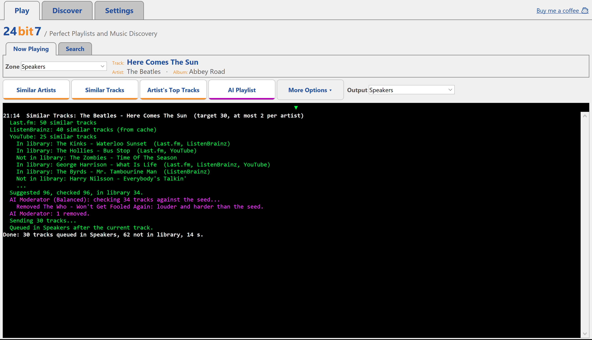

### The seed

Every playlist starts from a seed. The seed is whichever of the two small tabs is showing when you press a button.

- **Now Playing** shows what JRiver is playing. **Zone** picks which JRiver zone you seed from. If that zone's Playing Now is empty, the buttons seed from the last track JRiver played.
- **Search** lets you type any artist and track, whether you own it or not. Press Enter for Similar Artists. **Behaviour**, beside Track, is **Play Instantly** or **Review Mode**. Review Mode loads the playlist into Playing Now and leaves it stopped on track one, so you can remove tracks, change the order or add them to another playlist in JRiver before you press play. If the zone is already playing, the playlist queues after the current track either way. It's for builds from Search only: Now Playing, voice commands, shortcuts and Non-stop always play straight away, and it isn't used when Output is YouTube.

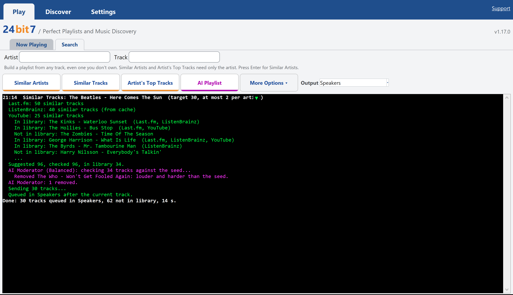

### The four buttons

| Button | What you get |
|---|---|
| **Similar Artists** | A playlist from artists similar to the seed. Each artist, the seed included, adds a random pick from its top tracks, so the same seed gives a different playlist every time. |
| **Similar Tracks** | Tracks like the seed track, suggested song by song, so the playlist follows the song rather than the artist's reputation. |
| **Artist's Top Tracks** | The artist's most popular tracks that you own, shuffled or in popularity order. From Search it needs only the artist. |
| **AI Playlist** | Describe a mood or a scene, choose More tracks like the song that's playing, or pick one of three suggestions, and the AI chooses a playlist from your library. Needs an Anthropic key. |

### Output

**Output** decides where the finished playlist goes:

- **Same zone**, the default: the zone you seeded from.
- **Any JRiver zone** by name.
- **YouTube**: the playlist opens in your browser as an instant YouTube playlist. JRiver isn't touched. See [YouTube output](#youtube-output).

### More Options

**More Options** opens a second row. It remembers whether it was open.

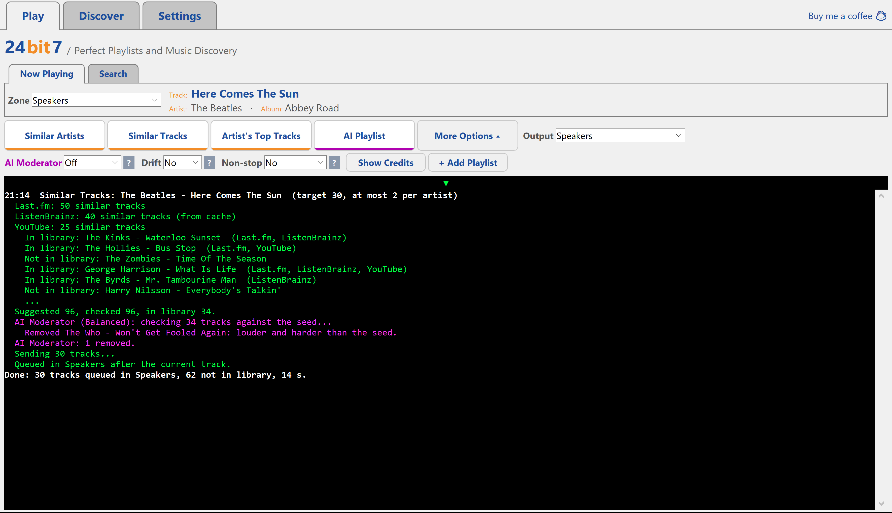

- **AI Moderator** checks each playlist for tracks that clash with the seed's mood. See [AI Moderator](#ai-moderator).
- **Drift** (Off, Keep It Tight or Spread) and **Non-stop** (Off, Keep It Tight or Let's See Where This Goes) set those settings for every Play option at once. See [Drift](#drift) and [Non-stop](#non-stop).
- **Variety** (Yes or No), for Similar Tracks only. No takes the closest matches in order; Yes picks at random from a wider pool, so the same seed gives a different playlist each time. It's the same setting as in Settings > Playlist, for the Main Window. See [Similar Tracks](#similar-tracks).
- **Show Credits** lists the producer, engineer and other credits for the album that's playing, from Discogs. It needs a Discogs token.
- **+ Add Playlist** joins one of your JRiver playlists to the next build. See [Adding your own playlists](#adding-your-own-playlists).

### The console

The black panel shows what each build did: which sources answered, what matched in your library, and where it went. Every build is written the same way, so it reads at a glance:

- The first line has the time and what was built, such as `21:14  Similar Tracks: The Beatles - Here Comes The Sun`.
- The steps are indented beneath it, in green.
- `Note:` lines, in amber, are something to know. `Problem:` lines, in red, are something that went wrong. Where a setting would help, it's named at the end, such as `Settings > Playlist > Drift`.
- AI lines, such as the AI Moderator's, are magenta.
- Every build ends with one line: `Done: 30 tracks queued in Speakers, 62 not in library, 14 s.`

Click into the console for a strip of buttons:

- **Copy** copies what's on screen, or just what you've highlighted.
- **Clear** empties the screen. Nothing kept in the Log is deleted.
- **Export to Log** saves a report for when something goes wrong. See [Reporting a problem](#reporting-a-problem).
- **Query** asks Claude why a playlist came out the way it did. It only shows once Console Query is switched on. See [Console Query](#console-query).
- **Simple** or **Advanced**: Simple hides the debug lines, which are dim grey and start `[debug]`; Advanced shows them. They're always recorded, so switching works on the build already there, and Export to Log always includes them. Your choice is remembered.

#### The console's tabs

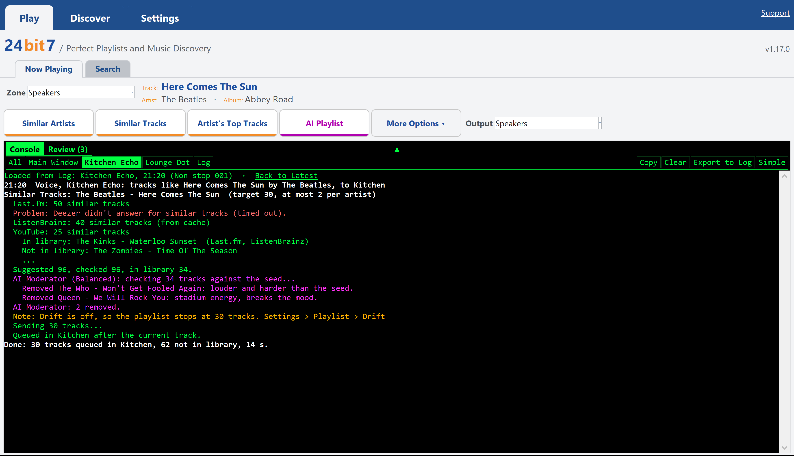

The small green arrow at the top middle of the console opens a row of tabs:

- **All**: the latest build from anywhere.
- **Main Window**: the latest build from the Play tab or a keyboard shortcut.
- **One per Alexa device**: that device's latest build, including commands that came to nothing. A device gets its tab after its first build.
- **Log**: every build kept, below.

A build only clears the screen when its own tab, or All, is showing, so a voice command in the kitchen won't wipe a build you're reading at the PC. With the tabs open, the strip sits at the top right. New lines don't pull you down while you're scrolled up. Open or closed is remembered.

#### The Log

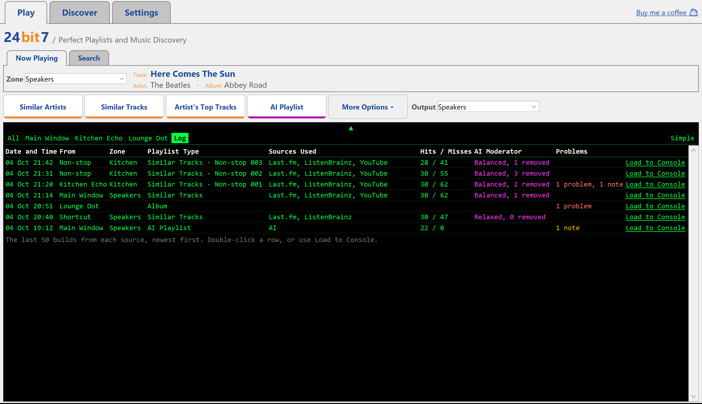

The Log lists the last 50 builds from each source, newest first: when, who asked (Main Window, Shortcut, an Alexa device, or Non-stop), the zone, the Play option, the sources used (hover for the full list), tracks queued and not in library, what the AI Moderator did, and how many problems and notes it had.

A Non-stop playlist shows as a chain. The build that started it becomes Non-stop 001 and each top-up takes the next number, so you can see how long an evening ran and spot which top-up went wrong.

Double-click a row, or click **Load to Console**, to open that build in its tab. A line at the top says it came from the Log, with **Back to Latest** to return. Copy, Query and Export to Log then work on that build.

### Adding your own playlists

Open **More Options** and press **+ Add Playlist** to join a JRiver playlist or smartlist to the next build from the Play tab. Each row has a handle to drag it up or down, the playlist, and how it joins:

- **Add before**: its tracks play first, in the playlist's own order.
- **Add after**: its tracks follow 24bit7's, in their own order.
- **Mix**: its tracks are woven through 24bit7's. **Spaced evenly** spreads both lists over the whole playlist so they finish together. **Mixed randomly** scatters them.

Rows play in the order they're listed. The picker shows the playlists you use most first, then the rest A to Z, with a search box.

Added playlists come through exactly as JRiver gives them, so a smartlist's own rules decide what's in it. 24bit7's filters, recent-play skip and hidden-track check leave them alone, and the only thing dropped is a song already in 24bit7's picks. If nothing in the build matches your library, the added playlists still play, so you never get silence.

They are for the Play tab only, with JRiver output. Voice, keyboard shortcuts and non-stop don't use them, and YouTube output leaves them out with a note in the console.

---

## The Discover tab

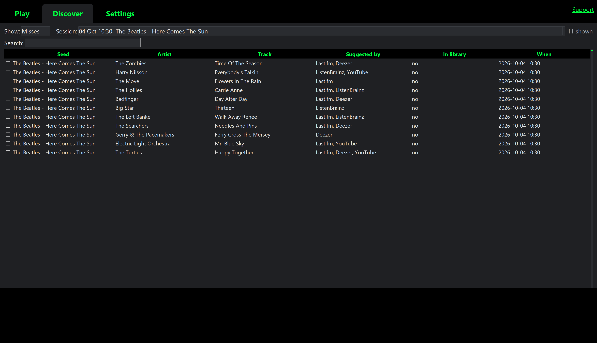

Discover lists every track a build looked for and whether you own it.

- **Show** picks Misses (tracks you don't own), Hits, or All.
- **Session** narrows it to one build. It opens on the latest build until you pick one yourself, with **All sessions** first in the list and the rest newest first. **Search** looks across every column.
- Select a row and each site you've ticked under Settings > Search has a button along the bottom. Stores and YouTube search for the artist and track; reference sites such as Wikipedia and Discogs search for the artist, for the discography.
- **Label** finds who released the selected track and opens the label on Bandcamp, so you can buy from the people who put the record out. It asks MusicBrainz first, then Discogs if you have a token. A self-released track opens the artist on Bandcamp. Each answer is remembered, so a second click is instant. Untick it under Settings > Search > Record Label if you don't want it.
- Tick rows, or **Select All**, and **Create YouTube playlist** opens them in your browser as one playlist, so you can hear the misses before you buy.
- **Clear All** empties the history and **Clear Selected** removes just the ticked rows. Both ask first.
- **CSV** saves the list as a spreadsheet file. **Font size** sets the size of the table text.

---

## Settings

Settings are grouped into pages, each made of boxed sections. A setting's explanation sits behind the small **?** beside it. Everything saves as you change it, and the running app picks it up without a restart.

### Sources

Which services suggest music, set separately for Similar Artists, Similar Tracks and Artist's Top Tracks. AI Playlist always uses the AI, so it has no tab here.

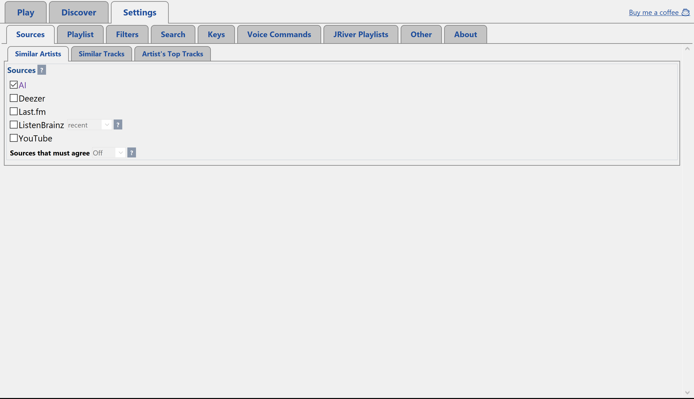

- **Sources**: tick any combination. One is enough; several are better. A source whose key is missing says "(no key yet)".
- **Sources that must agree**: how many ticked sources must suggest an artist or track before it's used. Higher means a smoother playlist with fewer surprises. See [Blending](#blending).
- **ListenBrainz algorithm**: all-time, or recent listening.
- **AI Moderator**, for Similar Artists and Similar Tracks: Off, Relaxed, Balanced or Strict. See [AI Moderator](#ai-moderator).

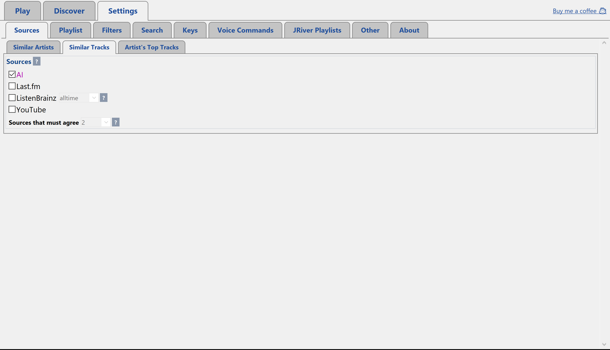

### Playlist

How each Play option builds its playlist, with a tab for each option.

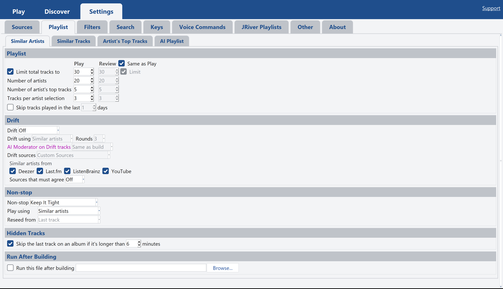

- **Playlist**: Similar Artists sets **Limit total tracks to**, how many artists, how many of each artist's top tracks to draw from, and how many to pick per artist. Untick the limit to keep every track found; with the last two the same (say 5 of 5) as well, there's no random pick at all. Similar Tracks sets how many tracks, the most any one artist gets, the order and **Variety**. Artist's Top Tracks sets shuffled or popular order.
- **Skip tracks played in the last ... days** leaves out anything JRiver has played recently, so a favourite doesn't come round again the same evening. The seed track is never left out. Off by default.
- **Drift** (Off, Keep It Tight or Spread) searches again when your library falls short of the target length. Similar Artists and Similar Tracks also have **AI Moderator on Drift tracks**. See [Drift](#drift).
- **Non-stop** (Off, Keep It Tight or Let's See Where This Goes) keeps a playlist going when it reaches its last track. See [Non-stop](#non-stop).
- **Hidden Tracks** skips the last track on an album when it's longer than a set number of minutes (6 by default). Those are often a long silence and a hidden bonus track, which feel out of place in a playlist. Albums, songs and playlists you ask for by name always play in full.
- **Run After Building** runs a file of your choice once a playlist is in JRiver: a .bat, an .exe, or a PowerShell or Python script. It's told nothing about the playlist, so it can do whatever you like. Non-stop top-ups don't run it.

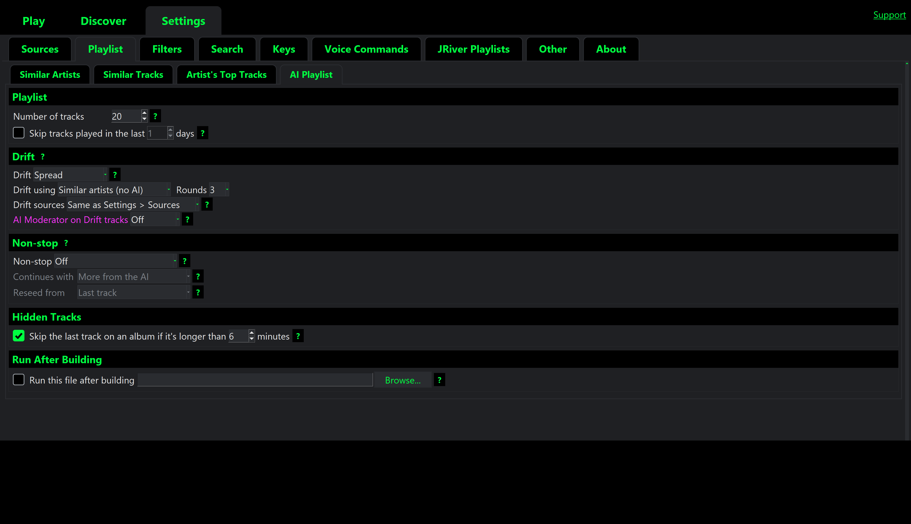

The AI Playlist tab has its own Drift choices, including drifting with the AI, and **AI Moderator on Drift tracks** for what Drift adds from your music sources.

### Filters

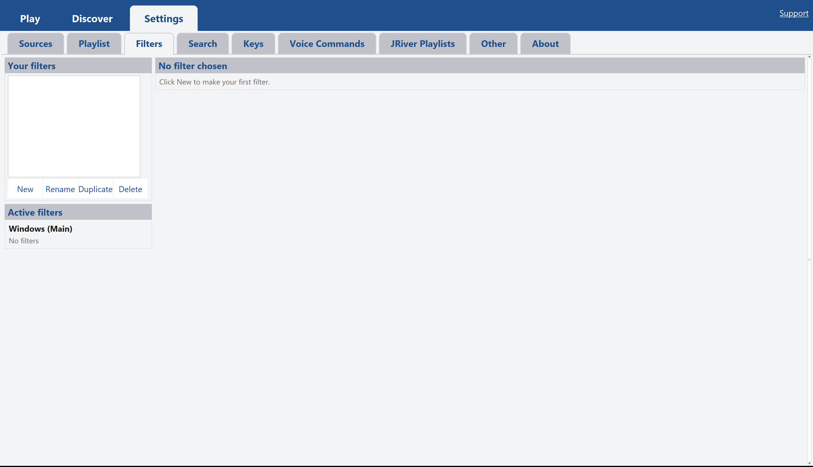

A library of named filters that narrow what 24bit7 picks, including Drift rounds and non-stop top-ups. Each filter has:

- **Applies on**: All devices, Windows (Main) (the Play tab and any speaker without its own settings), or a speaker with its own settings. Where several filters apply, a track must pass them all.
- **Only pick from**: a JRiver playlist or smartlist, so only its tracks can be used. Anything you can set up in JRiver's smartlist editor, 24bit7 respects.
- **Rules**, matching all or any: Rating, Year, Last played, Play count, Date imported, Genre, Artist, Album, Duration, File type, Bit depth, Sample rate and File location. For example, "Sample rate at most 48 kHz" saves JRiver converting on the fly for a Sonos.

A track with no value for a field passes that rule. The seed track is never filtered out. Each build's console says which filters applied and how many tracks they left out. Albums, songs, shuffles and JRiver playlists asked for by voice play as asked.

### Search

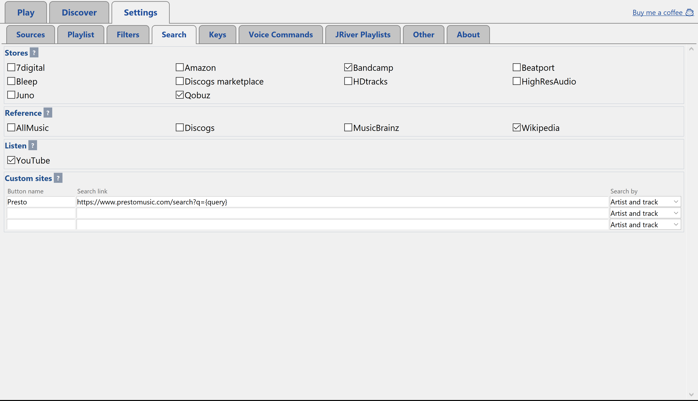

The sites that get a button on the Discover tab: **Record Label** (the Label button, ticked by default), **Stores** (at least one stays ticked), **Reference** sites for discographies, and **Listen** sites. **Custom sites** adds up to three of your own: search for anything on the site, copy the address from your browser, and replace your search words with `{query}`.

### Keys

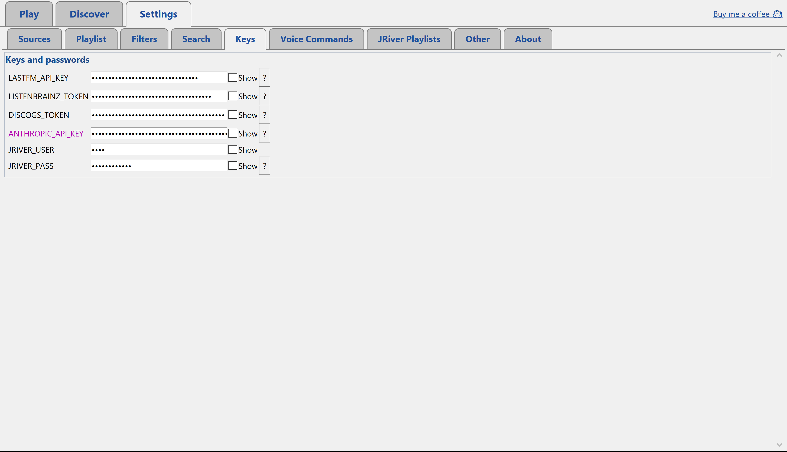

Keys and passwords for each service, hidden until you tick **Show**. Each **?** explains where to get the key:

- **Last.fm** and **ListenBrainz**: free, and well worth adding.
- **Discogs**: free, for album credits and a second source for Label.
- **Anthropic**: paid, a few pence at most per build. Needed for AI Playlist, AI as a source, the AI Moderator and Console Query. It sits last, in its own box, with **AI Usage** underneath: the tokens each AI feature has used since you last cleared the count, with estimated costs, and a **Guide** to what $1 buys and what each feature costs per run (your own average once you've used it three times). **Query** asks Claude where the tokens go and which settings would use fewer, and answers in the console. **Show in Now Playing** puts the total at the right of Now Playing, in dollars or tokens; click it to switch. The costs are estimates from Anthropic's standard rates on the date shown, which may have changed since; Anthropic's console has your actual bill.
- **JRiver** user name and password: only if you set them in JRiver under Tools > Options > Media Network > Authentication.

Keys never leave your PC except to the service they belong to, and they never appear in a log.

### The Voice Commands page

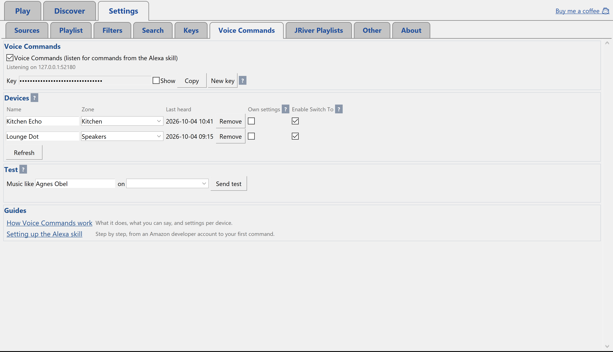

Switches voice on, holds the key the Alexa skill sends, and lists each Alexa device with the zone it plays to. **Enable Switch To** picks which zones "switch" can move the music to; two devices on the same zone share one tick, and a zone no device plays to isn't offered. **Switch Timing Adjustment** fine-tunes switching to a Sonos or other DLNA speaker: if it repeats the last moment you heard in the other room, move it towards minus; if it skips a little, towards plus. **Test** sends a pretend command, as if a device had heard it. See [Voice Commands](#voice-commands) and [Setting up the Alexa skill](#setting-up-the-alexa-skill).

### JRiver Playlists

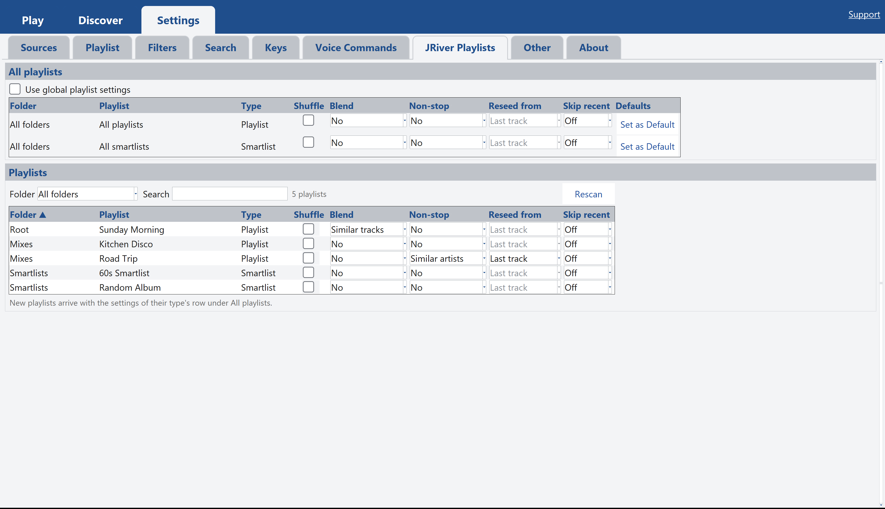

How your own JRiver playlists and smartlists play when you ask for them by voice: **Shuffle**, **Blend**, **Non-stop**, **Reseed from** (Last track, 2nd track, or **Whole playlist**, which is Keep It Tight: each top-up seeds from one of the playlist's own tracks) and **Skip recent**. **Set as Default** on the All playlists and All smartlists rows copies that row into the playlists of its type shown in the table (filter by folder first to set just one folder), and new playlists start with it. **Blend** weaves new music into the playlist, one of yours then one new, from similar artists or similar tracks, up to 50 new songs: the playlist starts at once and the new songs join a few seconds later. The **?** beside Blend and Non-stop explains each. Tick **Use global playlist settings** to set them all at once, or untick it and give each playlist its own row. The table shows each playlist's folder and type, sorts by folder or name, and can show one folder at a time. A playlist with nothing changed plays exactly as JRiver has it.

### Other

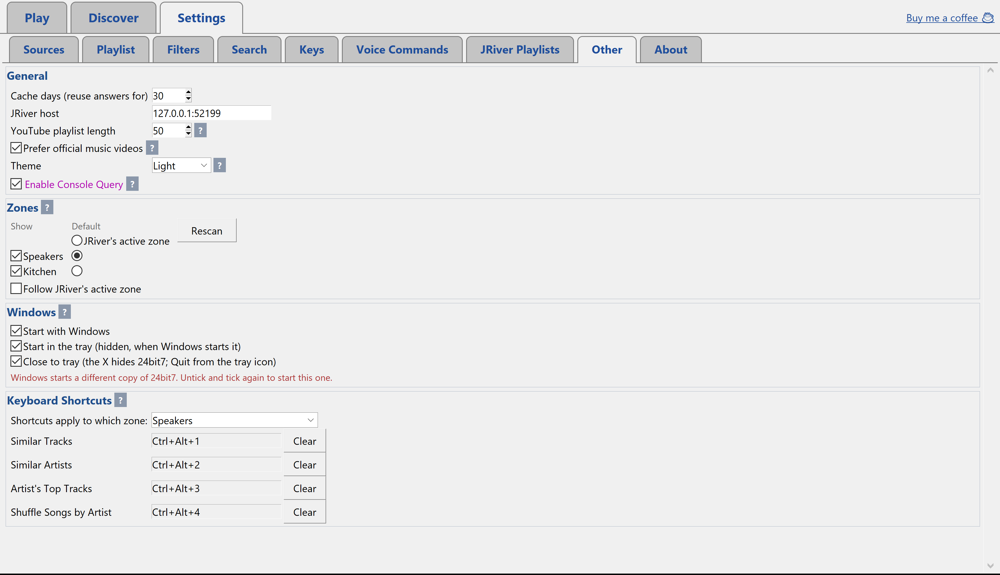

- **General**: **Keep Cache For** (1 Month, 1 Year or Permanent) with **Clear Cache...** (older than a month, older than a year, or everything), the JRiver host if JRiver runs on another PC, the YouTube playlist length (up to 50), **Prefer official music videos**, the **Theme** (Light or Dark, applied on restart), **Use the Windows title bar** (unticked, the tabs run to the top of the window with their own minimise, maximise and close), and **Enable Console Query**.
- **Zones**: which JRiver zones appear in the Zone and Output lists, which zone Now Playing opens on, and whether it follows JRiver's active zone. A DLNA speaker such as a Sonos only appears once DLNA Controller is ticked in JRiver (Tools > Options > Media Network > Advanced); press **Rescan** after ticking it.
- **Windows**: **Start with Windows** launches 24bit7 when you sign in. **Start in the tray** keeps it hidden when Windows starts it. **Close to tray** makes the window's close button hide 24bit7 instead of quitting, so voice keeps listening; quit from the tray icon.
- **Keyboard Shortcuts**: a key each for Similar Tracks, Similar Artists, Artist's Top Tracks, Shuffle Songs by Artist, **Switch Zones** (moves what's playing to the next zone ticked under Enable Switch To) and **Keep It Going** (Non-stop, once, for whatever the shortcut zone is playing). They work anywhere in Windows, even with 24bit7 in the tray, so a remote that sends key presses (a Flirc, a Harmony, a phone app) can start a playlist from the sofa. Click a box and press the keys; Esc cancels. Letters and numbers need Ctrl, Alt, Shift or Win; F-keys and media keys work on their own. If another program already owns a combination, 24bit7 says so.

### About

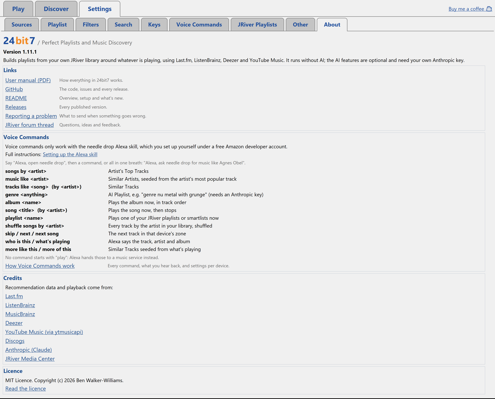

The version you're running, links to this manual, GitHub and the release notes, the voice commands at a glance, and credits for the services 24bit7 uses.

---

## How playlists are built

### Blending

Each ticked source returns a ranked list. 24bit7 merges them with position weighting: near the top of one list scores well, appearing on several lists scores better. It fetches more than it needs and trims, so the result reflects agreement between sources rather than the quirks of one.

**Sources that must agree** sets how many sources must suggest an artist or track before it's used. If too few clear the bar, 24bit7 relaxes it one step at a time, never below 2, and says so in the console. This is what keeps out the noise some services add, such as whatever else their listeners happened to play that day.

### Similar Tracks

Similar Artists asks "who sounds like this artist?". Similar Tracks asks "what sounds like this song?", which follows the mood of the seed far more closely: two songs by the same artist lead to different places. Its sources are Last.fm, ListenBrainz, YouTube Music and, if ticked, AI. A track two or three sources agree on ranks above one only a single source suggests. By default it takes the closest matches in order, so the same seed gives the same playlist. With **Variety** on, it collects up to twice as many matches as it needs and picks at random, the closest the most likely, so the same seed gives a different playlist each time.

### YouTube Music as a source

YouTube Music is asked "if someone is playing this track, what would you play next?". The answer is a queue of around fifty tracks chosen for the mood of the track.

- **Ticked with other sources**, the queue is boiled down to its artists, and that list votes in the blend like any other.
- **Ticked on its own**, Similar Artists plays the queue as it comes: each track is looked up in your library and the hits are queued in YouTube's order. The seed artist is kept to about a quarter of the playlist.

It needs no key and no sign-in. It relies on an unofficial library, ytmusicapi, so when YouTube changes something it can break until that library catches up.

### Fast start

With nothing playing on the output zone, the first track found starts straight away and the rest follows into Playing Now as it's found, so music starts within a second or two. If something is already playing, it carries on and the new playlist queues behind it. YouTube output waits for the full list, since the link is made once. Review Mode on the Search tab turns fast start off: the playlist loads at the end and stays stopped.

### Queueing

New tracks are queued around the current one: the rest of Playing Now is cleared, the current track keeps playing with no gap, and the new playlist follows it. Playing Now then holds exactly "what I was listening to, plus what 24bit7 chose", which saves cleanly as a JRiver playlist. A stopped zone starts the playlist straight away. If you seed from one zone and send to another, the seed track opens the playlist on the new zone.

### Drift

A library doesn't always have enough to reach the target length. With **Drift** on, 24bit7 searches again from what it has already found, three seeds a round, looking up their similar tracks or similar artists, whichever **Drift using** says.

- **Keep It Tight** seeds only from the first round's tracks, so nothing strays more than two steps from your seed. If the first round was short it can run out of seeds and finish short; the console says when.
- **Spread** seeds from across the whole playlist, Drift's own finds included, so it can travel further while branching in several directions. **Rounds** sets how many times it tries, from 1 to 6. More rounds fill more gaps but wander further from the seed. With JRiver output, the first pass is queued straight away and each round is added as it's found.

**Drift sources** can follow Settings > Sources, or use **Custom Sources** with their own **Sources that must agree**, so the first pass stays steady and the top-up is more adventurous.

In an AI Playlist, Drift can top up from your music sources, which uses no credit, or ask the AI again, telling it what's already been tried.

### AI Moderator

Most playlists are right apart from one track: the stadium anthem in the middle of a run of acoustic songs. The AI Moderator sends each playlist to Claude once, with the seed, and removes tracks that would jolt a listener out of the mood. It judges tone, energy and mood, never genre on its own. Tracks it doesn't know well enough to judge are kept, and each removal is logged with its reason.

- **Relaxed** removes only clear clashes, at most a fifth of the tracks.
- **Balanced** removes anything that noticeably shifts the tone, energy or mood, at most two fifths.
- **Strict** keeps only tracks close to the seed, however many that leaves. Drift can top a short playlist up.

A few extra tracks are found up front so removals are replaced. It costs a fraction of a penny per playlist. If the check fails, the playlist builds as normal and the console says why.

Drift rounds are checked against the playlist so far as well as the seed, which makes an odd one out much easier to spot. **AI Moderator on Drift tracks** (Similar Artists and Similar Tracks) can check Drift harder than the first round, or not at all; Same as build follows the build's own level. When most of what one seed brought in is off course, the rest of it goes too and Drift doesn't seed from that chain again, within the level's limit.

### Non-stop

With **Non-stop** on, 24bit7 watches the zone, and when the last track of a playlist it built starts playing, it adds more. **Keep It Tight** reseeds each top-up from a track of the original playlist, a different one each time, so the evening stays close to where it started; when every one has been used, it carries on as **Let's See Where This Goes** and the console says so. Let's See Where This Goes follows the music:

- **Similar Artists and Similar Tracks** carry on using similar artists or similar tracks, seeded from the **last track** (so the music wanders as the evening goes on) or the **2nd track** (so it stays closer to where it started).
- **Artist's Top Tracks** can first play the rest of the artist's songs in your library, shuffled, then carry on from their most popular track.
- **AI Playlist** can ask the AI for more, or carry on with similar artists or similar tracks, which use no credit.

Every top-up passes through your filters and skips anything the zone already had. Only playlists 24bit7 sent are topped up: an album you start in JRiver yourself ends as normal.

### Library matching

Recommendations arrive as names, and names are messy. 24bit7 handles accents, look-alike punctuation, version tags such as "(Remastered)", "&" against "and", bracketed words either way round, dotted initials (UNKLE and U.N.K.L.E.), sort names ("XX, The"), JRiver's multi-value artists, band credits ("The Jimi Hendrix Experience" finds "Jimi Hendrix"), and a dropped "g" ("Smokestack Lightnin'" finds "Smokestack Lightning"). The whole library is held in memory when 24bit7 starts, so matching is instant.

### YouTube output

With Output set to YouTube, the playlist is built as usual, then each track's video is looked up and the list opens in your browser as an instant playlist: no sign-in, nothing saved to an account. A video is only accepted if the artist matches, because a cover is worse than a gap. YouTube audio is lossy, so this is for hearing something before you buy it, or for someone who doesn't own the music.

### Cache and history

Every answer from every service is kept in a local database for a month by default (Keep Cache For, under Settings > Other: 1 Month, 1 Year or Permanent), so a repeat build on the same seed costs nothing, AI credit included. **Clear Cache...** removes answers older than a month, older than a year, or all of them. An answer that MusicBrainz doesn't know an artist is always rechecked after a month. The same database records every build and every hit and miss, which is what Discover shows.

---

## Voice Commands

Voice Commands let you ask for music out loud. Say "Alexa, ask needle drop for music like Agnes Obel" in the kitchen, and a playlist from your own library starts on the kitchen speaker a second or two later.

It works through an Alexa skill of your own, which you set up once. That isn't a one-click job: [Setting up the Alexa skill](#setting-up-the-alexa-skill) takes you through it. 24bit7 works fully without it.

### How it fits together

1. You speak to an **Alexa device**.
2. **Your Alexa skill**, hosted by Amazon, hears the command and sends it with a secret key and the device's ID to your PC's address on the internet.
3. **Tailscale Funnel** gives your PC that address and passes the request to 24bit7. Your router needs no changes.
4. **24bit7** checks the key, looks up which zone that device plays to and which settings it uses, then builds or plays the music there.

### What you can say

Open the skill first ("Alexa, open needle drop"), then say the command, or say it all in one breath: "Alexa, ask needle drop for music like Agnes Obel".

| Say | You get |
|---|---|
| "songs by *artist*" | Artist's Top Tracks |
| "music like *artist*" | Similar Artists, seeded from the artist's most popular track |
| "tracks like *song*", or "tracks like *song* by *artist*" | Similar Tracks |
| "genre *anything*", such as "genre nu metal with grunge" | AI Playlist (needs an Anthropic key) |
| "album *name*" | Plays the album now, in track order |
| "song *title*" | Plays the song now, then stops |
| "playlist *name*" | Plays one of your JRiver playlists or smartlists now, with its settings from Settings > JRiver Playlists |
| "shuffle songs by *artist*" | Every track by the artist in your library, shuffled, opening on one of their best known songs |
| "skip", "next" or "next song" | The next track in that device's zone |
| "who is this" or "what's playing" | Alexa says the track, artist and album playing in that device's zone |
| "more like this" or "more of this" | Similar Tracks from what's playing. The current track carries on and the new playlist replaces what was queued after it |
| "switch", or "switch to *zone*" | Moves what's playing to another zone, at the same song and point; the zone it left stops |
| "stop the music", "pause the music" or "resume the music" | Stops, pauses or resumes that device's zone |
| "keep it going", "non stop" or "go continuous" | Turns on Non-stop for whatever is playing in that device's zone, once |
| "list commands" or "help" | Alexa reads the commands once |

**Switch** moves the music from the zone that's playing (the asking device's own, if it is) to another zone ticked under **Enable Switch To**. With two zones it goes straight to the other one; with three or more, Alexa asks which and you answer "to the kitchen", or say it up front: "switch to the kitchen". It carries on from the same song and point, a paused zone arrives paused, and Non-stop follows the music. A Sonos or other DLNA zone carries on from the same point too: it starts quietly, jumps to the right place once it's playing, and the room you left stops a moment later. Fine-tune it with Switch Timing Adjustment under Settings > Voice Commands. A plain "Alexa, stop" goes to the speaker itself, so stopping a JRiver zone needs "ask needle drop to stop the music".

When several albums or songs share a title, Alexa asks which artist, and you answer "by *artist*". When two playlists share a name, she asks which, and you answer "by smartlist", "by playlist" or "by" and the folder. To skip the question, say it up front: "playlist vocal jazz smartlist".

No command starts with "play". Alexa tends to hand anything starting with "play" to a music service instead of the skill.

Skip, who is this and more like this always need the skill's name: "Alexa, ask needle drop to skip". A plain "Alexa, skip" goes to the speaker itself, which has no queue of its own when it's playing a JRiver zone. An Alexa Routine can give you a shorter phrase: set "next song" to run the custom action "ask needle drop to skip".

The skill name is up to you. This one is "needle drop" because Alexa kept mishearing the first choice.

### What you hear

- **"Ready."** when the skill opens and is waiting.
- **"Sorry, I didn't catch that. Say list commands to hear them."** once, when a command isn't recognised. The full list is only read when you ask for it.
- **"Which zone?"** after "switch" when three or more zones are ticked.
- **A short tone** when a command is accepted. The music follows almost at once.
- **"Please wait, request pending."** if another playlist is still building. Yours runs as soon as it finishes.
- **"That's *track* by *artist*, from *album*."** after "who is this".
- **"Nothing's playing on *zone*."** after skip, who is this or more like this when the zone is stopped, and **"Nothing to skip to."** on the last track.
- **A spoken explanation** when something is wrong, such as a device without a zone. [Troubleshooting voice](#troubleshooting-voice) lists each one.

Albums, songs, playlists and shuffles need no building, so they replace whatever is playing at once. Playlists that are built use [fast start](#fast-start) and queue behind anything already playing.

### Keeping it going

With **Non-stop** ticked for a Play option, a playlist a voice command built carries on when it reaches its last track. "Shuffle songs by" carries on the same way once the shuffle runs out. Your own JRiver playlists can keep going too, set per playlist under Settings > JRiver Playlists. Albums and songs end as normal, unless you say **"keep it going"**: that turns on Non-stop once for whatever the zone is playing, even an album you started in JRiver, using the zone's Similar Tracks Non-stop settings: Let's See Where This Goes if Non-stop is Off there, otherwise the mode chosen there. It ends when something else replaces the music.

A JRiver playlist with **Blend** set doesn't wait for its end: new songs are woven through it from the start, one of yours then one new, until up to 50 new songs run out.

### Devices and their settings

Every Alexa device that speaks to 24bit7 appears under **Settings > Voice Commands > Devices** the first time it's used. Give it a name and choose its JRiver zone, and from then on its commands play there.

By default every device uses the same settings as the Windows app, called **Windows (Main)**. To give a device its own:

1. Under **Settings > Voice Commands > Devices**, tick **Own settings** for the device.
2. **Settings > Sources**, **Playlist** and **JRiver Playlists** now show a row of tabs: Windows (Main), then one per ticked device.
3. Each device tab starts with **Copy Windows (Main)** ticked, following the Windows app. Untick it to change that device's settings. Each page is separate, so a device can have its own Sources while its Playlist still follows Windows (Main).

A device with its own settings can also be named under **Applies on** in a filter, such as keeping the kitchen to a "Kitchen Favourites" playlist. Keys, search sites and zones stay shared.

Two speakers make it easy to compare two sets of settings: the same command in the kitchen and the lounge, one with the AI Moderator on and one without. Untick **Own settings** and the device goes back to Windows (Main); its own settings are kept for next time.

### Good to know

- Voice only works while 24bit7 and JRiver are running. **Settings > Other > Windows** can start 24bit7 with Windows, hidden in the tray.
- Playlists are built one at a time, from the app or from voice.
- Every playlist a voice command builds shows in the console, under the device's own tab and in All. A command that comes to nothing shows there too, with what Alexa said.

---

## Setting up the Alexa skill

This sets up the Alexa skill that sends spoken commands to 24bit7. It takes about an hour the first time and costs nothing, but it isn't a one-click setup: you create your own skill on Amazon's developer site and open a secure route from the internet to 24bit7 on your PC.

Amazon rearranges its developer console from time to time, so these steps describe what to do rather than every button's exact name. If a label doesn't match, look for the nearest equivalent.

### What you need

- A Windows PC running 24bit7, with JRiver Media Center or Media Server on the same PC.
- An Amazon developer account (free), signed in with the **same Amazon account as your Alexa devices**. A skill in development only works on devices registered to the account that created it.
- A Tailscale account (free for personal use).
- At least one Alexa device. Anything with Alexa built in works, including a Sonos speaker with Alexa.

### Step 1: switch on Voice Commands in 24bit7

1. Go to **Settings > Voice Commands**.
2. Tick **Voice Commands**. A key is made for you, and the status line should say it's listening on 127.0.0.1:52180.
3. Under **Test**, type an artist, pick a zone and press **Send test**. The playlist should build on that zone. This proves the listener works before anything else is involved.

The key is hidden. Tick **Show** beside it, or use **Copy**, when you need it in Step 5.

### Step 2: give your PC an address with Tailscale Funnel

1. Install Tailscale on the PC from tailscale.com and sign in.
2. In the Tailscale admin console, on the DNS page, switch on **MagicDNS** and **HTTPS certificates**.
3. Open PowerShell and run:

   ```
   tailscale funnel --bg 52180
   ```

   The first time, Tailscale asks you to approve Funnel for your network, with a link to follow. Approve it, then run the command again.
4. Check it and note your address:

   ```
   tailscale funnel status
   ```

   It shows an address like `https://your-pc.your-tailnet.ts.net`, proxying to `http://127.0.0.1:52180`.
5. Test it from outside your home network. On your phone, with Wi-Fi off, open your address followed by `/ping`. A reply saying **wrong key** is exactly right: the request reached 24bit7, and 24bit7 refused it because the browser didn't send the key.

`--bg` keeps Funnel running in the background, and it comes back by itself after a restart.

### Step 3: create the skill

1. Go to the Alexa developer console at developer.amazon.com and sign in with the same Amazon account as your devices.
2. Create a new skill:
   - **Name:** anything you like. Only you see it.
   - **Language:** the one your devices use, such as English (UK).
   - **Type:** a custom skill.
   - **Hosting:** **Alexa-hosted (Python)**, so Amazon runs the code for free and you don't need an AWS account. Pick the region nearest you.
   - **Template:** start from scratch.
3. Wait a minute or so while Amazon sets it up.

### Step 4: add the interaction model

The interaction model is the list of phrases the skill understands.

1. Open [alexa/interaction_model.json](https://github.com/24bit7/24bit7/blob/main/alexa/interaction_model.json) on GitHub and copy all of it.
2. In the console, go to **Build**, then **Interaction Model**, then **JSON Editor**. Paste over everything there, then **Save** and **Build**.
3. The file sets the invocation name, the words that open the skill, to **needle drop**. You can change it on the `invocationName` line before building. Keep it to plain lower-case words.

Pick words Alexa can't mistake for something else. This project first used "bit seven", and Alexa heard "bet seven" every time. If the skill doesn't open, the Alexa app's voice history shows exactly what Alexa heard.

### Step 5: add the code

1. Go to the **Code** tab. On the left is a folder called `lambda` holding `lambda_function.py`.
2. **Create the settings file first.** In the `lambda` folder, create a file called `skill_settings.py`. Copy in [alexa/skill_settings.py](https://github.com/24bit7/24bit7/blob/main/alexa/skill_settings.py) from GitHub, then fill in two values:
   - `BIT7_URL`: your address from Step 2, starting with `https://`, in quotes, with nothing after `.ts.net`.
   - `BIT7_KEY`: the key from Settings > Voice Commands, in quotes.

   Leave `CHIME` empty and Alexa says "Ready" when the skill opens. To use a different acceptance tone, pick one from the Alexa Skills Kit Sound Library and put its `soundbank://` address in an `ACK_TONE` line, as the file shows.
3. Open `lambda_function.py` and paste over it with [alexa/lambda_function.py](https://github.com/24bit7/24bit7/blob/main/alexa/lambda_function.py) from GitHub.
4. **Save**, then **Deploy**.

Your address and key only ever go in `skill_settings.py`. The code in `lambda_function.py` holds neither, so it's safe to share.

### Step 6: test it

**In the console first.** Go to the **Test** tab and set testing to **Development**. Type `open needle drop`. It should answer "Ready". Then type a command such as `album dummy`. The console isn't a device 24bit7 knows yet, so the reply should be **"This device isn't set up yet"**, which proves the whole route works. The console then appears in Settings > Voice Commands as a new device: give it a zone to keep testing from the console, or press **Remove**.

**Then on a device.**

1. Say "Alexa, open needle drop". It should say "Ready".
2. Say a command, such as "music like Agnes Obel". The first time, you hear "This device isn't set up yet".
3. In 24bit7, go to **Settings > Voice Commands** and press **Refresh** under Devices. The device appears as "New device 1". Name it and choose its zone.
4. Try the command again. Alexa plays a short tone and the music starts on that zone within a second or two.

Repeat for each device.

### Step 7: keep it running

Voice only works while 24bit7 and JRiver are running, so let both start on their own:

- In 24bit7, **Settings > Other > Windows**: tick **Start with Windows**, and leave **Start in the tray** ticked. **Close to tray** stops the window's close button switching voice off by accident.
- In JRiver, set Media Center or Media Server to start with Windows. Media Server on its own is enough.
- Tailscale Funnel already comes back by itself after a restart.

Restart the PC and try a command without opening anything. If the music plays, you're done.

### Troubleshooting voice

Every command that comes to nothing also appears in the console, under the device's tab and in the Log, with exactly what Alexa said back.

| Alexa says or does | What it means | What to try |
|---|---|---|
| "24bit7 isn't answering. Is it running on the media PC?" | The skill couldn't reach 24bit7. | Check 24bit7 is running and Settings > Voice Commands says it's listening. Run `tailscale funnel status`. Check `BIT7_URL` in `skill_settings.py` letter by letter. |
| "24bit7 didn't accept the key..." | The key in the skill doesn't match 24bit7's. | Copy the key from Settings > Voice Commands into `skill_settings.py` again, then Save and Deploy. You always need to do this after pressing **New key**. |
| "This device isn't set up yet..." | 24bit7 doesn't know which zone this device plays to. | Settings > Voice Commands, **Refresh**, choose a zone for the device. |
| "I can't find the ... zone in JRiver." | The zone has been renamed, or JRiver isn't running. | Start JRiver, or choose the zone again. |
| "Sorry, something went wrong in the skill." | The skill's code failed. | Usually `skill_settings.py` is missing, misnamed or has a typo. It must sit in the `lambda` folder next to `lambda_function.py`. The Code tab links to the skill's logs, which name the error. |
| "Please wait, request pending." | Another playlist is still building. | Nothing: yours runs next. |
| The skill doesn't open at all | Alexa didn't recognise the invocation name. | Check what it heard in the Alexa app's voice history, and choose a clearer name. |
| Music comes from Amazon Music or Spotify instead | The command started with "play", or the skill name was missed. | Leave out "play". Use "ask needle drop for ..." if the skill keeps being missed. |

To check the route from the PC itself, this sends the same request the skill does (with your own address and key):

```
Invoke-RestMethod https://your-pc.your-tailnet.ts.net/ping -Headers @{'X-24bit7-Key'='your-key'}
```

A reply with `ok: True` and 24bit7's version means everything on the PC side works.

### Keeping it private

- 24bit7's listener only accepts connections from the PC itself. The only way in from outside is the Funnel address, and every request must carry your key or it's refused.
- Treat the key and the address like a password. Keep `skill_settings.py` out of screenshots, and never commit your real values to a public repository.
- If the key is ever exposed, press **New key** in Settings > Voice Commands, put the new key in `skill_settings.py` and Deploy. The old key stops working at once.
- To switch voice off, untick Voice Commands. To close the route as well, run `tailscale funnel reset`.

---

## When something goes wrong

### Common problems

| What happens | What to try |
|---|---|
| Now Playing says nothing is playing, or the Zone list is empty | Check JRiver is running with Media Network on. If JRiver runs on another PC, set its address under Settings > Other > JRiver host. If you set a user name and password in JRiver, add them under Settings > Keys. |
| A source is skipped, with "no key" in the console | Add its key under Settings > Keys, or untick it under Settings > Sources. |
| AI options are greyed out | They need an Anthropic key, and credit on the Anthropic account. |
| YouTube Music stops returning anything | YouTube has probably changed something. It usually comes back with the next update of the ytmusicapi library; untick it meanwhile. |
| A playlist comes out short | Your library may not hold enough of what the sources suggest. Lower **Sources that must agree**, tick more sources, or switch on **Drift**. |
| One track sounds out of place | Try the **AI Moderator** on Relaxed or Balanced. |
| A speaker such as a Sonos is missing from the zones | Tick DLNA Controller in JRiver (Tools > Options > Media Network > Advanced), then press **Rescan** under Settings > Other > Zones. |
| Windows says "Windows protected your PC" | Click **More info**, then **Run anyway**. The app isn't code-signed. |

### Console Query

When a playlist comes out short or odd, you can ask why. Tick **Enable Console Query** under Settings > Other (it asks first, as it uses Anthropic credit), click into the console and press **Query**. Type a question and press Enter: "Why was this track included?", "Why was the playlist so short?", "What did the AI Moderator remove?". The answer appears in the console in magenta, and the box stays open for follow-ups.

Claude is sent the build on screen, your settings with every key and password left out, what's playing, and 24bit7's own code and README, so it knows the rules and the names of the settings. It suggests up to three changes, named as they appear in Settings. The build on screen can be any of the last 50, opened from the Log. Switch the console to **Advanced** first and Claude gets the debug lines too. The first question costs a few pence; follow-ups soon after cost much less.

### Reporting a problem

1. Do the thing that went wrong. For a build that happened earlier, open it from the Log instead.
2. Click into the console and press **Export to Log**. With the console's tabs open, it's at the top right.

24bit7 writes a dated file to the `logs` folder beside it, with the version, Windows and JRiver details, library size, your settings with every key and password hidden, and the build on screen, debug lines included. The folder opens with the file selected. Attach it when you report the problem on [GitHub](https://github.com/24bit7/24bit7/issues).

---

## Sources and your data

| Source | Used for | Key |
|---|---|---|
| JRiver | Now playing, library search, queueing | No (on the same PC by default) |
| Last.fm | Similar artists, similar tracks, top tracks | Free |
| ListenBrainz and MusicBrainz | Similar artists, similar tracks, top recordings, record labels | Free, only for top recordings |
| Deezer | Similar artists, top tracks, checking names | None |
| YouTube Music | Similar artists and tracks, YouTube output | None |
| Discogs | Album credits, record labels | Free |
| Anthropic (Claude) | AI suggestions, AI Playlist, AI Moderator, Console Query | Paid, pennies per build |

Your music files never leave your PC. Services are sent the artist and track names they're asked about, and Console Query sends the console as described above. Everything 24bit7 learns is kept in `24bit7.db` beside the app, and your keys in `.env`. Neither file is ever included in a log or a release.
