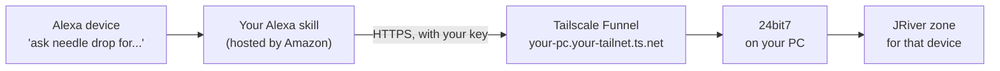

# How Voice Commands work

Voice Commands let you ask for music out loud. Say "Alexa, ask needle drop for music like Agnes Obel" in the kitchen, and a playlist built from your own library starts on the kitchen speaker a second or two later.

It works through an Alexa skill of your own, which you set up once. That part is not a one-click job, and [Setting up the Alexa skill](VOICE_SETUP.md) takes you through it step by step. This page explains what Voice Commands do once they're running. 24bit7 works fully without them.

---

## How it fits together

- The **skill** runs on Amazon. It hears the command and sends it, with a secret key and the ID of the device that heard it, to your PC's address on the internet.
- **Tailscale Funnel** gives your PC that address and passes the request through to 24bit7. Your router needs no changes.
- **24bit7** checks the key, looks up which zone that device plays to and which settings it uses, then builds or plays the music there.

## What you can say

Open the skill first ("Alexa, open needle drop"), then say the command, or say it all in one breath: "Alexa, ask needle drop for music like Agnes Obel".

| Say | You get |
|---|---|
| "songs by *artist*" | Artist's Top Tracks |
| "music like *artist*" | Similar Artists, seeded from the artist's most popular track |
| "tracks like *song*", or "tracks like *song* by *artist*" | Similar Tracks |
| "genre *anything*", such as "genre nu metal with grunge" | Vibe Playlist (needs an Anthropic key in 24bit7) |
| "album *name*" | Plays the album now, in track order |
| "song *title*" | Plays the song now, then stops |
| "playlist *name*" | Plays one of your JRiver playlists or smartlists now |
| "shuffle songs by *artist*" | Every track by the artist in your library, shuffled, opening on one of their best known songs |

When several albums or songs share a title, Alexa asks which artist, and you answer "by *artist*".

No command starts with "play". Alexa tends to hand anything starting with "play" to a music service instead of the skill, so the skill avoids the word.

The skill name is up to you. This one is "needle drop" because Alexa kept mishearing the first choice. An Alexa Routine can shorten "open needle drop" to a phrase of your own.

## What you hear

- **"Ready."** when the skill opens and is waiting for a command.
- **A short tone** when a command is accepted. There's nothing more to say: the music follows almost at once.
- **"Please wait, request pending."** if another playlist is still being built. Yours runs as soon as that one finishes.
- **A spoken explanation** when something is wrong, such as a device that hasn't been given a zone yet. The troubleshooting table in the setup guide lists each one.

## Why the music starts so quickly

Building a playlist can take anywhere from a few seconds to half a minute, depending on how many sources 24bit7 asks. With nothing playing in the zone, 24bit7 doesn't wait for the whole list: the first track it finds starts straight away, and the rest follows it into Playing Now as it's found. This is called fast start, and it's always on.

If something is already playing, it carries on, and the new playlist queues up behind it.

Albums, songs, playlists and shuffles need no building, so they replace whatever is playing at once.

## Devices and their settings

Every Alexa device that has spoken to 24bit7 appears under **Settings > Voice Commands > Devices**, the first time it's used. Give it a name and choose the JRiver zone it plays to, and from then on that device's commands play in that zone: the kitchen speaker in the kitchen, the lounge Dot in the lounge.

By default, every device uses the same settings as the Windows app, called **Windows (Main)**. A device can have settings of its own instead:

1. Under **Settings > Voice Commands > Devices**, tick **Own settings** for the device.
2. **Settings > Sources** and **Settings > Playlist** now show a row of tabs: Windows (Main), then one per ticked device.
3. Each device tab starts with **Copy Windows (Main)** ticked, greyed out and following the Windows app. Untick it to change that device's settings. Sources and Playlist are separate, so a device can have its own Sources while its Playlist still follows Windows (Main).

What a device can have its own copy of:

- **Sources:** which services suggest similar artists, similar tracks and top tracks, how many must agree, and the **AI Moderator**, which checks each playlist for tracks that clash with the seed's mood.
- **Playlist:** track counts, Drift, skipping tracks played recently, and skipping long album closers that hide a bonus track.

Keys, search sites, zones and the rest stay shared.

**An example.** Two speakers make it easy to try two sets of settings side by side: the same command in the kitchen and the lounge, one with the AI Moderator and Drift on, one without, and you can hear which works better. Or the kitchen device can simply suit someone else's taste, with the moderator on and anything played in the last day left out, while the lounge Dot stays on Windows (Main).

Untick **Own settings** and the device goes back to Windows (Main). Its own settings are kept, so ticking it again brings them back.

"Shuffle songs by" uses the **Skip tracks played in the last** setting from the device's Artist's Top Tracks, since a shuffle has no group of its own.

## Good to know

- Voice Commands only work while 24bit7 and JRiver are running on the PC. **Settings > Other > Windows** can start 24bit7 with Windows, hidden in the tray.
- Playlists are built one at a time, whether they come from the app or from voice.
- Every playlist a voice command builds appears in the Play tab's log, with the device's name, so you can see what it found and why.
