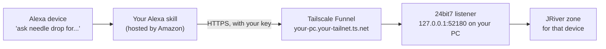

# Setting up the Alexa skill

This guide sets up an Alexa skill that sends spoken commands to 24bit7, so you can say "Alexa, ask needle drop for tracks like Big Yellow Taxi" and hear the playlist start in that room. [How Voice Commands work](VOICE_COMMANDS.md) explains what it does once it's running, and lists everything you can say.

It takes about an hour the first time. Nothing here costs money, but it is not a one-click setup: you create your own skill on Amazon's developer site and open a secure route from the internet to 24bit7 on your PC. If any of that sounds like more than you want to take on, 24bit7 works fully without it.

Amazon rearranges its developer console from time to time, so the steps below describe what to do rather than the exact name of every button. If a label doesn't match, look for the nearest equivalent.

---

## How it fits together



- The **skill** runs on Amazon. It hears the command and sends it, with a secret key and the ID of the device that heard it, to an address on the internet.
- **Tailscale Funnel** gives your PC that address and passes the request through to 24bit7. Your router needs no changes and no ports are opened on it.
- **24bit7** checks the key, works out which zone that device belongs to, and builds or plays the music there.

## What you need

- A Windows PC running 24bit7 1.4.0 or later, and JRiver Media Center or Media Server on the same PC.
- An Amazon developer account (free), signed in with the **same Amazon account as your Alexa devices**. A skill in development only works on devices registered to the account that created it.
- A Tailscale account (free for personal use).
- At least one Alexa device. Anything with Alexa built in works, including a Sonos speaker with Alexa.

---

## Step 1: switch on Voice Commands in 24bit7

1. Open 24bit7 and go to **Settings > Voice Commands**.
2. Tick **Voice Commands**. A key is made for you, and the status line should say it is listening on 127.0.0.1:52180.
3. Under **Test**, type an artist, pick a zone and press **Send test**. The playlist should build on that zone. This proves the listener works before anything else is involved.

The key is hidden. Tick **Show** beside it, or use **Copy**, when you need it in Step 5.

## Step 2: give your PC an address with Tailscale Funnel

1. Install Tailscale on the PC from tailscale.com and sign in.
2. In the Tailscale admin console, on the DNS page, switch on **MagicDNS** and **HTTPS certificates**.
3. Open PowerShell and run:

   ```
   tailscale funnel --bg 52180
   ```

   The first time, Tailscale asks you to approve Funnel for your network, with a link to follow. Approve it, then run the command again.
4. Check it and note your address:

   ```
   tailscale funnel status
   ```

   It shows an address like `https://your-pc.your-tailnet.ts.net`, with a line saying it proxies to `http://127.0.0.1:52180`.
5. Test it from outside your home network. On your phone, with Wi-Fi switched off, open your address followed by `/ping`, for example `https://your-pc.your-tailnet.ts.net/ping`. A reply saying **wrong key** is exactly right: it means the request reached 24bit7, and 24bit7 refused it because the browser didn't send the key.

`--bg` keeps Funnel running in the background, and it comes back by itself after a restart.

## Step 3: create the skill

1. Go to the Alexa developer console at developer.amazon.com and sign in with the same Amazon account as your devices.
2. Create a new skill:
   - **Name:** anything you like. It is only shown to you.
   - **Language:** the one your devices use, for example English (UK).
   - **Type:** a custom skill (a custom interaction model).
   - **Hosting:** **Alexa-hosted (Python)**, which means Amazon runs the code for free and you don't need an AWS account. Pick the hosting region nearest you.
   - **Template:** start from scratch.
3. Wait a minute or so while Amazon sets the skill up.

## Step 4: add the interaction model

The interaction model is the list of phrases the skill understands.

1. Open `alexa/interaction_model.json` from this repository and copy all of it.
2. In the console, go to **Build**, then **Interaction Model**, then **JSON Editor**. Select everything there, paste over it, then **Save** and **Build**.
3. The file sets the invocation name, the words that open the skill, to **needle drop**. You can change it on the `invocationName` line before building. Keep it to plain lower-case words.

**Choosing an invocation name.** Pick words Alexa can't mistake for something else. This project first used "bit seven", and Alexa heard "bet seven" every time. If your skill doesn't open, the Alexa app's voice history shows exactly what Alexa heard, which tells you what to change.

## Step 5: add the code

1. Go to the **Code** tab. On the left is a folder called `lambda` holding `lambda_function.py`.
2. **Create the settings file first.** Create a new file in the `lambda` folder called `skill_settings.py`, so its path is `lambda/skill_settings.py`. Copy in the contents of `alexa/skill_settings.py` from this repository, then fill in the two values:
   - `BIT7_URL`: your address from Step 2, starting with `https://`, in quotes, with nothing after `.ts.net`.
   - `BIT7_KEY`: the key from Settings > Voice Commands, in quotes.

   Leave `CHIME` empty and Alexa says "Ready" when the skill opens. When a command is accepted, Alexa plays a short tone rather than speaking. To use a different tone, pick one from the Alexa Skills Kit Sound Library and put its `soundbank://` address in an `ACK_TONE` line, as the file shows.
3. Open `lambda_function.py`, select everything, and paste over it with the contents of `alexa/lambda_function.py` from this repository.
4. **Save**, then **Deploy**.

Your address and key only ever go in `skill_settings.py` in the console. The code in `lambda_function.py` holds neither, so it is safe to show or share.

## Step 6: test it

**In the console first.** Go to the **Test** tab and set testing to **Development**. Type:

```
open needle drop
```

It should answer "Ready". Then type a command, for example `album dummy`. Because the console isn't a device 24bit7 knows yet, the reply should be **"This device isn't set up yet"**, which proves the whole route works. The console then shows up in Settings > Voice Commands as a new device: give it a zone if you'd like to keep testing from the console, or press Remove.

**Then on a device.**

1. Say "Alexa, open needle drop". It should say "Ready".
2. Say a command, for example "music like Agnes Obel". The first time, you hear "This device isn't set up yet".
3. In 24bit7, go to **Settings > Voice Commands** and press **Refresh** under Devices. The device appears as "New device 1". Give it a name and choose the JRiver zone it should play to.
4. Try the command again. Alexa plays a short tone and the music starts on that zone within a second or two.

Repeat for each device. Every device remembers its own zone, so the kitchen speaker plays in the kitchen and the lounge Dot in the lounge. To give a device settings of its own, tick **Own settings** beside it; [How Voice Commands work](VOICE_COMMANDS.md#devices-and-their-settings) explains how.

You can also say it all in one breath: "Alexa, ask needle drop for music like Agnes Obel".

## Step 7: keep it running

Voice Commands only work while 24bit7 and JRiver are running, so let both start on their own:

- In 24bit7, **Settings > Other > Windows**: tick **Start with Windows**, and leave **Start in the tray** ticked so it waits out of sight. **Close to tray** stops the window's close button from switching voice off by accident.
- In JRiver, set Media Center or Media Server to start with Windows. Media Server on its own is enough for everything 24bit7 does.
- Tailscale Funnel already comes back by itself after a restart.

Restart the PC and try a command without opening anything. If the music plays, you're done.

---

## Troubleshooting

| Alexa says or does | What it means | What to try |
|---|---|---|
| "24bit7 isn't answering. Is it running on the media PC?" | The skill couldn't reach 24bit7. | Check 24bit7 is running and Settings > Voice Commands says it's listening. Run `tailscale funnel status`. Check `BIT7_URL` in `skill_settings.py` letter by letter: a stray character, such as `hhttps`, breaks it. |
| "24bit7 didn't accept the key..." | The key in the skill doesn't match 24bit7's. | Copy the key from Settings > Voice Commands into `skill_settings.py` again, then Save and Deploy. After pressing **New key** in 24bit7 you always need to do this. |
| "This device isn't set up yet..." | 24bit7 doesn't know which zone this device plays to. | Settings > Voice Commands, Refresh, choose a zone for the device. |
| "I can't find the ... zone in JRiver." | The device's zone has been renamed, or JRiver isn't running. | Start JRiver, or choose the zone again in Settings > Voice Commands. |
| "Sorry, something went wrong in the skill." | The skill's code failed. | Usually `skill_settings.py` is missing, misnamed or has a typo. It must sit in the `lambda` folder next to `lambda_function.py`. The Code tab links to the skill's logs, which name the error. |
| "Please wait, request pending." | Another playlist is still building. | Nothing: yours runs as soon as that one finishes. |
| The skill doesn't open at all | Alexa didn't recognise the invocation name. | Check what it heard in the Alexa app's voice history, and choose a clearer name in Step 4. |
| Music comes from Amazon Music or Spotify instead | The command started with "play", or the skill name was missed. | Leave out "play". Use "ask needle drop for ..." if the skill keeps being missed. |

To check the route from the PC itself, this sends the same request the skill does (use your own address and key):

```
Invoke-RestMethod https://your-pc.your-tailnet.ts.net/ping -Headers @{'X-24bit7-Key'='your-key'}
```

A reply with `ok: True` and 24bit7's version means everything on the PC side is working.

## Keeping it private

- 24bit7's listener only accepts connections from the PC itself (127.0.0.1). The only way in from outside is the Funnel address, and every request through it must carry your key or it is refused.
- Treat the key and the address like a password. Keep `skill_settings.py` out of screenshots and screen recordings, and never commit your real values to a public repository: the copy in this repository holds placeholders only.
- If the key is ever exposed, press **New key** in Settings > Voice Commands, then put the new key in `skill_settings.py` and Deploy. The old key stops working at once.
- To switch voice off entirely, untick Voice Commands in 24bit7. To close the route as well, run `tailscale funnel reset`.
